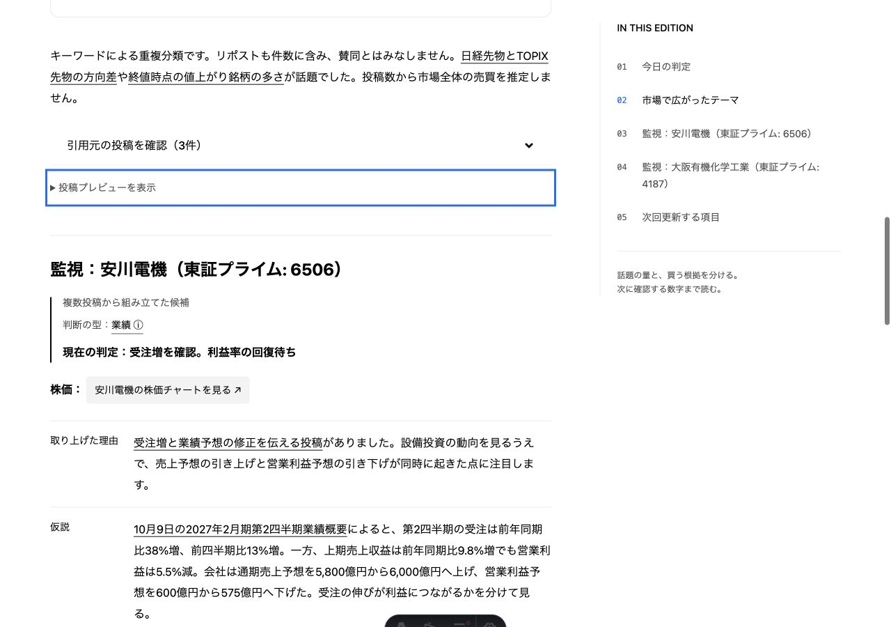
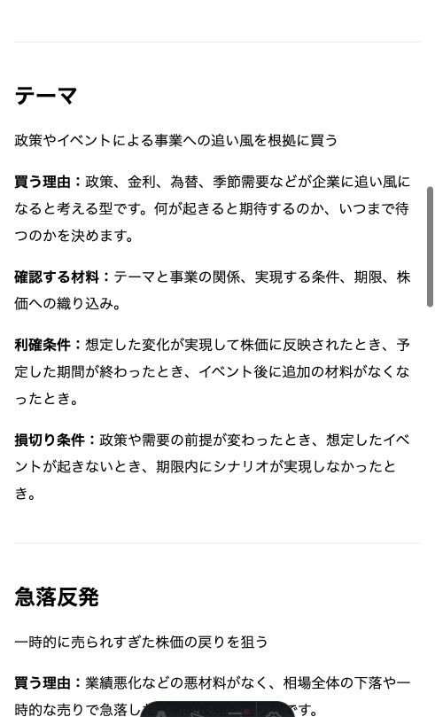

# Base Web redesign

## References and version

- https://baseweb.design/ (documentation and desktop reference, 2026-10-11)
- https://github.com/uber/baseweb (MIT)
- Installed `baseui` 18.2.0. Source of truth is the installed LightTheme, not main.
- Astro 5 + @astrojs/react 4 + React 18.3.1; Styletron Server for static surfaces and Client for sharing.

## UI mapping

| Surface                          | Implementation                                                                  | Reason                                                          |
| -------------------------------- | ------------------------------------------------------------------------------- | --------------------------------------------------------------- |
| Share controls                   | Official BaseProvider + Button (primary/secondary, compact)                     | Standard interaction and focus states                           |
| Masthead                         | Official HeaderNavigation, NavigationList/Item, tertiary Button, and StyledLink | Rendered at build time; no navigation JavaScript                |
| Older editions                   | Semantic Astro links with installed theme tokens                                | Preserve multi-line summaries and full-row links                |
| Latest edition                   | Official Card, neutral Tag, LabelSmall, and ParagraphSmall                      | Standard light surface, padding, border, radius, and typography |
| Article location                 | Official Breadcrumbs and StyledLink                                             | Static navigation with the current date                         |
| Article                          | Astro + original Markdown renderer                                              | Preserve nested content, embeds, anchors, and static reading    |
| Post previews / metrics / charts | Custom layout with semantic tokens                                              | Content-specific geometry                                       |
| OGP                              | Satori layout with installed theme colors/radii                                 | React interactive components cannot render in Satori            |

## Design rules

White and black form the reading hierarchy. Blue marks focus, link hover, and one neutral data series. Neutral chips indicate metadata. Latest is an editorial distinction, not a positive market signal. Spacing follows Base Web's 4/8/12/16/24/32/40/48/64/96px scale. Headlines use semantic HeadingSmall through DisplayMedium variables resolved from the installed theme. createLightTheme overrides only non-mono font families; all typography sizes, weights, and line heights come from LightTheme. System fonts provide Japanese glyphs; no Uber brand fonts or artwork are copied. Japanese body text uses 1.9 line-height. Reading width (720px) and site width (1200px) are content constraints.

Static official components use renderToStaticMarkup with Styletron Server CSS. Prefixes isolate each sheet from the sharing island. Public overrides change the header wrapping, Card root to an anchor, Card heading to h2, and Card hover background; component defaults supply the rest.

The share island mounts only in the browser so Styletron does not emit unstyled SSR buttons. Static X and permalink links remain available during loading and without JavaScript. Copy success/errors are announced through output; failure directs users to copy the address bar. Article URLs, canonical/OG metadata, content pipeline and X embeds are retained.

## Validation

- Astro check: no errors, warnings, or hints (after the component alignment).
- Lint for src, Astro config, and OGP generator: passed. Repository-wide lint still flags existing collect.mjs prefer-const and unawaited test() calls.
- Production build: all 14 pages and 14 OGP images generated.
- Existing tests: 8 passed.
- Browser: archive and latest article inspected at desktop and 390px; archive and article at 320px, with no horizontal overflow. Official Card navigation and the new header/breadcrumbs were verified; the narrow header may wrap. Copy success and related-post disclosure verified. Real X embeds loaded.
- Share island adds approximately 101KB gzip of React/Base Web JavaScript to article pages; archive is rendered statically with a small native search script.
- Package installation reports legacy transitive peer-range warnings from Base Web dependencies; the chosen React 18 satisfies Base Web's own peer range.

## Keep these content-specific choices

The site logo, archive arrangement, Markdown renderer, metric grid, and chart geometry remain custom. The body uses a 1.9 line height for Japanese reading, while headings and summaries use official line heights. Site and reading widths are content constraints. The X iframe controls its own UI. These are deliberate exceptions; they do not require custom replacements for available Base Web controls.

## Quality iterations (2026-10-11)

The quality references are [Awwwards evaluation](https://www.awwwards.com/about-evaluation/), [Webby judging criteria](https://www.webbyawards.com/judging-criteria/), and [FWA’s description of creative excellence](https://thefwa.com/FWA25/25.html). These guide design, navigation, content, inclusion, functionality, originality, and technical care. They are not a certification or a prediction of an award.

Three review rounds improved the editorial hierarchy, useful interaction, and final detail. The archive now has a real-data observation graphic, an immediate latest-edition Button, and an official Input for title, summary, and date search. Articles use official Typography, neutral theme Tags, a responsive LayoutGrid with a sticky desktop TOC, official Table for chart values, and official Accordion for source links. Previous/next editions support continued reading. DataTable and Tabs are reserved for actual comparison and alternate-view requirements rather than inserted without a purpose.

Static source disclosures and links survive without JavaScript. X previews load their external script only after an explicit disclosure. Charts share a consistent scale, keep small values proportional, and show numeric labels outside bars. Mobile TOCs collapse initially; keyboard disclosure, focus feedback, and reduced-motion styling remain available.

The final review caught a Typography selector that did not reach through the BaseProvider wrapper; the mobile title now follows the intended HeadingMedium scale. Desktop, 390px, and 320px layouts were reviewed with no horizontal overflow. Search matches, no-results, reset, Accordion click/Enter, source preservation, and lazy X loading were exercised. `npm run verify:ui` checks all 13 articles, 206 source links, unique heading anchors, TOC targets, static fallback disclosures, table labels, metadata, and archive routes. Article JavaScript is approximately 101KB gzip shared across React, Base Web, sharing, and source enhancement; archive controls use a small native script without hydrating React.

The logo, observation graphic, archive rows, article composition, and chart geometry are custom; controls and text foundations use the installed Base Web definitions. Award-level originality and overall experience remain an external editorial judgment. No fabricated numeric self-score is assigned.

## Chart and metrics follow-up

Theme counts are shown as two separate bar-chart panels in the same theme order, stacked on mobile. Each panel scales to its own maximum, explicitly disclosed; lengths should only be compared within a panel. Counts and people have separate units. Overlapping classifications are not represented as pie-chart shares. All exact values remain available in the official Table.

Collection metrics now use an unboxed semantic definition list with official LabelSmall and HeadingSmall. CSS controls layout, dividers, and spacing only; it no longer substitutes typography sizes or mimics an official Card. This reduces competing surfaces above the article.

## Editorial quality review and exploration (follow-up)

A new review identified a weak cross-edition journey. Official secondary Buttons now filter archived editions by the exact theme labels in their source data, and combine with keyword/date search. Article Tags link to that theme’s archive URL. Selected themes are announced in the result status and stored in the URL; nested theme disclosures open on an incoming selected theme. The first iteration exposed all 20 labels, which overwhelmed the archive. The second iteration exposes the five most frequent labels plus All and places remaining labels in a keyboard-accessible disclosure. Existing classification differences are preserved rather than silently merged.

The hero’s wording now communicates the publication’s editorial point of view: follow the conversation and consider buying conditions, with sources and the next numbers to verify. All values behind the decorative hero bars are also available to screen readers. Repeated identical Styletron sheets are removed within each rendered article without changing class prefixes or HTML content.

| Quality criterion                  | Review result and evidence                                                                                                                                                                        |
| ---------------------------------- | ------------------------------------------------------------------------------------------------------------------------------------------------------------------------------------------------- |
| Editorial hierarchy and voice      | Hero states the content’s purpose; latest-edition entry remains primary; metrics are subordinate to reading.                                                                                      |
| Useful interaction and navigation  | Article-to-theme journey, keyword+theme intersection (1 result), empty state (0), and All reset (13) exercised in browser.                                                                        |
| Visual consistency                 | Base Web controls, theme tokens, official Typography; selected filters visibly outlined and expose aria-pressed.                                                                                  |
| Responsive layout                  | 1280, 390 and 320px: no horizontal overflow; mobile filters wrap; incoming hidden selection opens disclosure.                                                                                     |
| Content integrity                  | All 13 editions and 206 source links verified after build; static disclosures and article bodies retained.                                                                                        |
| Performance care                   | Archive uses static React-rendered HTML plus native filtering; duplicate article CSS eliminated, third-party previews remain opt-in. No Core Web Vitals claim made.                               |
| Originality and overall experience | Editorial positioning and source-driven theme exploration strengthened. Actual award selection and user preference require independent evaluation; no award score inferred from technical checks. |

This is an evidence-based internal review, not an assertion that every external jury criterion has been met. Remaining external validation includes audience usability sessions, cross-browser testing beyond the available browser, and measured field performance.

## 10-point self-review: three bounded iterations

Requested by the user: score the work out of ten, improve toward ten, stop if returns diminish, and do at most three iterations. This section replaces the earlier no-self-score policy for this user-requested internal review. Scores are subjective judgments against this project’s brief, not award probabilities, jury scores, or measurements. Five criteria are equally weighted. A ten requires exceptional, consistent execution across all five, not merely passing technical checks.

| Stage       | Hierarchy | Text/charts | Interaction | Distinctiveness | System consistency | Mean |
| ----------- | --------: | ----------: | ----------: | --------------: | -----------------: | ---: |
| Before      |       7.0 |         7.0 |         8.0 |             7.0 |                8.0 |  7.4 |
| Iteration 1 |       8.4 |         7.7 |         8.0 |             7.5 |                8.4 |  8.0 |
| Iteration 2 |       8.7 |         8.7 |         8.0 |             7.8 |                8.8 |  8.4 |
| Iteration 3 |       8.7 |         8.7 |         9.0 |             7.8 |                8.8 |  8.6 |

1. Condition lists had little hierarchy. The original hypothesis, buy, profit-taking, loss-cutting and next-action labels now form structured rows, horizontal on desktop and vertical on mobile. A selective Markdown renderer preserves ordinary lists, nested tokens, and links. Generated output verifies the number of transformed condition lists against source Markdown in every edition.
2. Company metadata was squeezed into one bold paragraph and chart labels were too small. The current judgment is separated from provenance/type metadata, and chart labels use the Base Web LabelSmall scale. Browser review discovered full-width whitespace creating blank flex rows; only separators between metadata strong elements were removed and the same layout was reviewed again.
3. Search and theme filters had no single recovery action. An official tertiary Button now clears both, removes the theme URL parameter, announces the full result count, and restores focus to the search input. Keyboard Enter reset verified: 13 results, empty input, archive-search focused.

Review conditions: latest article and archive; desktop1280, mobile390 and minimum320; no horizontal overflow. Graph number labels and condition reading structure reviewed in screenshots. Type/lint/build and all-edition content integrity verified.

Stopping reason: the requested maximum of three iterations was reached and gains narrowed from 0.6 to 0.4 to 0.2. Residual limitations: the visual identity remains restrained and less distinctive than exceptional creative editorial work; long source-heavy hypotheses still impose reading effort; broader Japanese-title/data combinations and independent audience evaluation would strengthen confidence. The final score is deliberately below ten.

## Motion polish

Motion uses installed Base Web timing200 (200ms), timing150 (150ms), and easeOutQuinticCurve. Official Accordion transitions use public Content, ContentAnimationContainer and ToggleIcon overrides with no added delay. Native theme, TOC and table disclosures progressively animate height when the browser supports interpolate-size and discrete transitions; other browsers retain instant native disclosure. X iframe previews retain native opening to avoid animating a changing external layout.

Theme-selection and reset feedback use a 200ms opacity/2px movement after immediate result updates, with no delay in accessibility status or interaction. Keyword typing does not trigger repeated animation. Superseded feedback is cancelled. A reduced-motion preference skips feedback, cancels feedback already running, and removes disclosure/TOC/selection transitions. There is no number counting, scroll-triggered content hiding, or initial article entrance.

## 判断の型の説明（2026-10-11）

記事の「型：業績」を「判断の型：業績 ⓘ」へ変更。型名を押すと `/decision-types/` の該当説明へ移動する。業績＋テーマなどの併記はそれぞれをリンクにした。分類・本文の意味は保持し、説明の定義は `src/lib/decision-types.ts` にまとめた。

採用部品は Base Web 18.2.0 の StyledLink と Typography。公式 Link ドキュメント（https://baseweb.design/components/link/）と導入版の `baseui/link` のAPI・スタイルを確認した。リンクは静的描画し、JavaScriptを追加しない。インラインのリンクは公開ThemeProviderでテーマを接続し、BaseProviderのブロック要素が段落に入り込むことを避ける。説明ページは通常のsectionとnavで構成し、余白・境界・フォーカスは既存トークンを使う。

内部評価は影響箇所だけを対象とする主観的な5軸評価（情報階層／文字／操作／独自性／システム整合）。開始は5／7／3／5／8、平均5.6。レビュー1回で説明導線とページを追加し、表示時に見つかったラベルとリンクの改行を修正して再確認した。最終は8／8／8／6／9、平均7.8。説明への移動と型の識別は改善したが、別ページに移動する手間は残る。追加の全面改修の効果は小さいため1回で終了。

本番ビルドで記事と説明ページ、複数型の旧号を確認。1280／768／390／320pxで確認した画面に横はみ出しなし。Enterによる説明への移動、フォーカス表示を確認。新規アニメーションはない。hoverの実機確認、動きを減らす設定の実機検証は未実施。check・変更箇所oxlint・build・verify:ui成功。クライアントバンドルのファイル名・サイズは変更前と同じ。説明ページはハイドレーションなし。既存の売買条件レイアウトにも「取り上げた理由」を追加した。

最終画面：

### 元メモとの再照合

元メモ「株の出口戦略と買いの理由のパターン」をブラウザで再読し、7型の説明を買う理由・確認材料・利確条件・損切り条件に分けた。移動平均線反発は「平均線付近での反発」から「平均線を大きく下回った価格の戻り」へ訂正。業績型の利確は成長期待の織り込み、損切りは業績前提の崩れとして区別した。編集プロンプトにも成功時と失敗時の出口を別々に書く指示を追加した。説明ページ内に元メモへの参照リンクを設けた。文章のみの改訂で、追加のデザイン採点は実施していない。check・oxlint・build・verify:ui成功、実画面で両条件の表示を確認。

## OGP follow-up

OGP now uses a flat white composition with the same three-bar masthead mark, black editorial headline, muted summary/date, thin dividers and a small blue accent. Fonts and spacing resolve from installed Base Web typography/sizing. Generic sharing uses the current two-line editorial statement; edition sharing preserves the full title, summary, date and collected-post count. Satori/resvg render at 1200×630 with Japanese Noto Sans JP; no browser-only Base Web component is hydrated for OGP.

Internal review: baseline 7.2/10 → first iteration 8.6/10 → final 8.7/10. First iteration aligns hierarchy and branding, verified on the generic and longest-title images. Second iteration removes the generic image’s repeated headline from its footer; latest-edition inspection also caught oversized text overlapping its summary. Edition and generic headline scales are now separate and were rechecked. Stop after two iterations because remaining improvements are small; scores reflect internal visual judgment, not award predictions. All 14 outputs are regenerated by the existing build pipeline.

## トピックのAI深掘り導線（2026-10-11）

株価チャートリンクの直下に「AIで深掘り」を追加。Base Web 18.2のButton（secondary / tertiary・compact）、ParagraphSmall、Textareaを静的描画する。開閉だけはネイティブdetailsを公式トークンで構成し、読書を妨げず、追加のReact hydrationを避ける。質問はセクションのMarkdown全文（出典・リンク・判断条件を含む）、観測日、固定リンクを保持する。参考サイト https://taxnap.com/ の実装と同じChatGPT `/?q=` / Claude `/new?q=` を使用する。ログイン状態やサービス側の変更による初期入力の差は保証しない。URLが12,000文字を超える場合は全文を切らず、コピーと通常のAIリンクに切り替える。この閾値はサービスの公式上限ではなく互換性を優先した判断。

局所レビューは1回。変更前の該当箇所を情報階層8・文字8・操作5・独自性7・整合9（平均7.4）、改善後を8・9・8・7・9（平均8.2）とした。主観的な内部評価。コピー・全文確認の逃げ道、狭幅の折り返し、公式Textareaとトークンの整合を改善して再確認した。今回の機能範囲で追加装飾の効果が小さいため停止。残る制約は外部AIの初期入力・ログイン後の引継ぎの実機確認。

本番ベースパスのビルドで1280 / 768 / 390 / 320pxの横はみ出しを確認。株価の直下、Enterによるdetailsの開閉、全文確認、コピー成功を確認。追加アニメーションなし（動きを減らす設定の実機切替は未実施）。`npm run check`、変更箇所oxlint、本番build、verify:ui、既存8テストが成功。verify:uiに全13記事のAI質問のセクション全文・観測日・リンク・長文フォールバック検証を追加。画面記録：`/private/tmp/market-daily-ai-mobile.png`（390px）。
